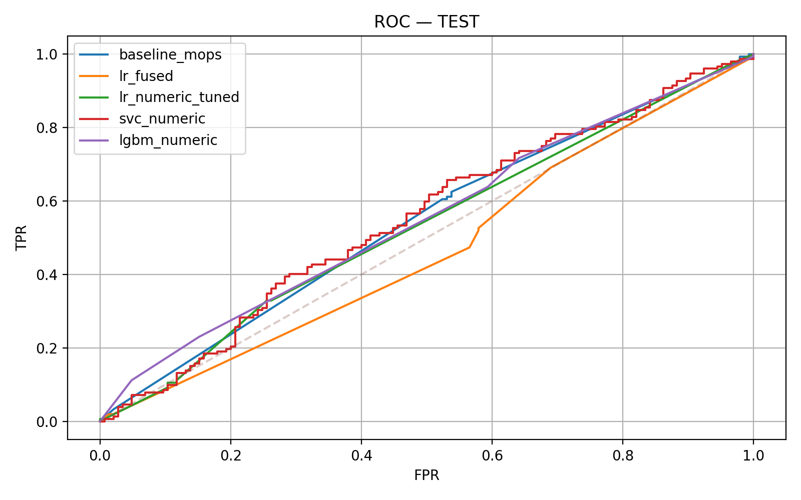
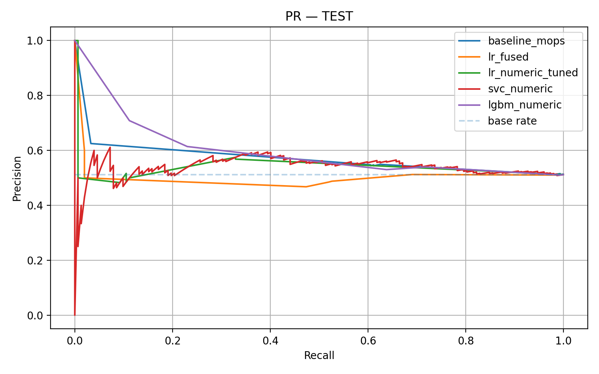
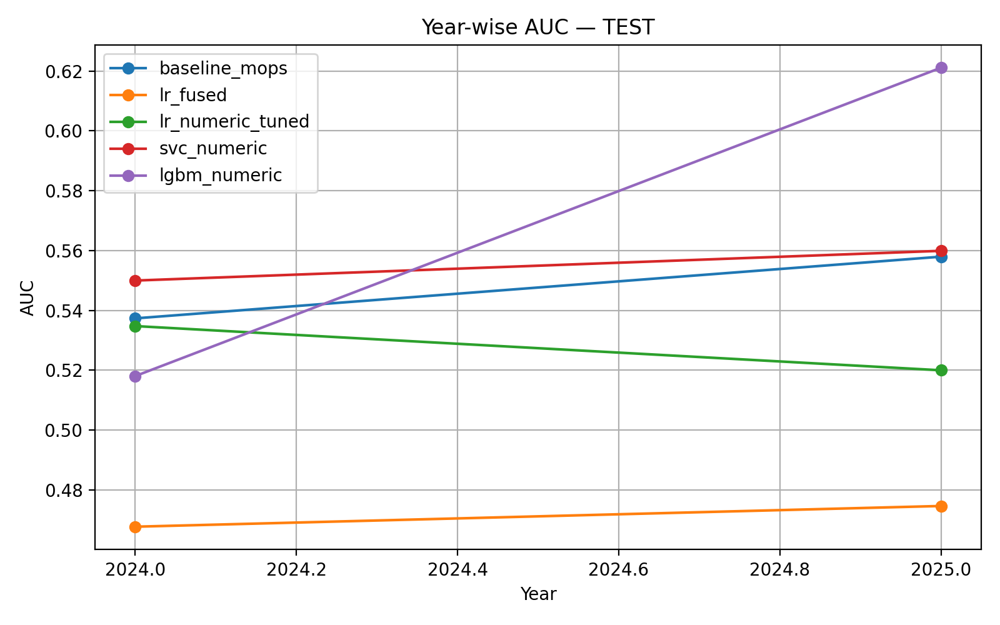
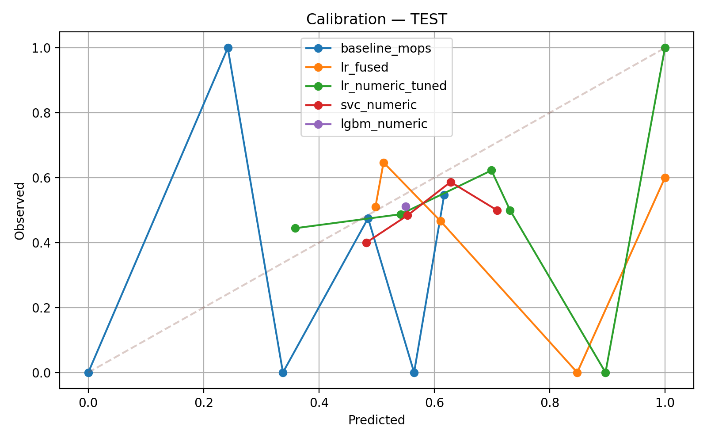
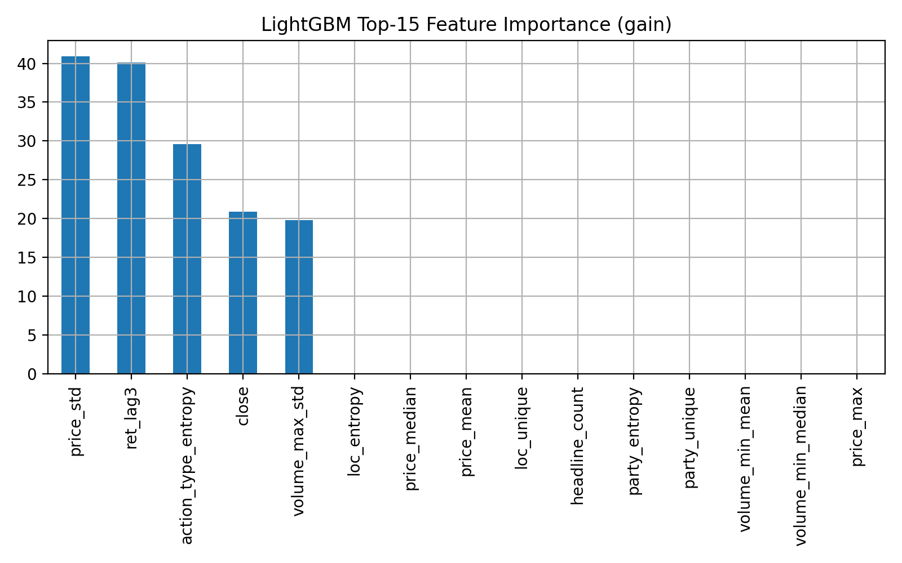
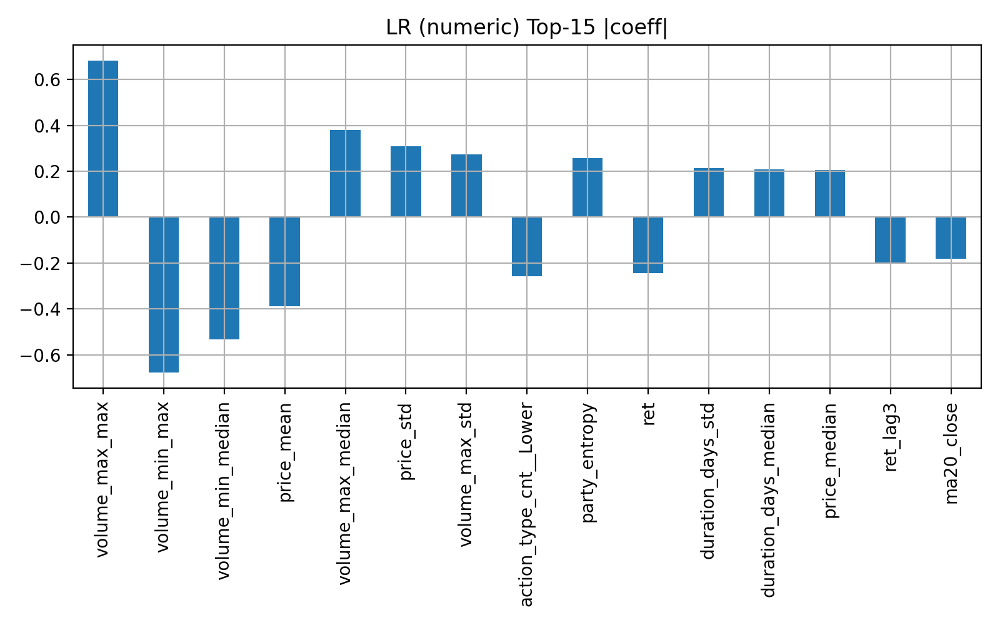

# Commodities Trading Strategy: NLP & Hybrid Factors (MOPS 380)


## 1. Executive Summary

**Project Duration:** May 2025 – December 2025  
**Advisor:** Dr. Ying Chen, National University of Singapore (NUS)

This project develops a systematic trading strategy for **MOPS 380 Fuel Oil** by extracting alpha from unstructured market chatter (HEARDS). Using a custom NLP pipeline to parse over **215,000 text-based trade signals**, I developed a **Hybrid Factor Model** that combines sentiment analysis, price momentum, and volatility regimes.

### Key Achievements

- **Sharpe Ratio:** 3.01 (out-of-sample 2024-2025)
- **CAGR:** 24.81%
- **Max Drawdown:** -5.67%
- **Win Rate:** 34.1%

The final strategy significantly outperformed traditional ML classifiers (XGBoost/LightGBM) and the buy-and-hold benchmark.

## 2. Performance Metrics (Out-of-Sample)

| Strategy | Sharpe Ratio | CAGR | Max Drawdown | Win Rate |
| :--- | :---: | :---: | :---: | :---: |
| **Hybrid Factor (Final Model)** | **3.01** | **24.81%** | **-5.67%** | **34.1%** |
| Event-Driven Baseline | 0.85 | 12.40% | -18.5% | 42.0% |
| Buy & Hold (Benchmark) | 0.42 | 5.20% | -35.0% | N/A |
| *ML Classifier (XGBoost)* | *-0.27* | *-2.36%* | *-30.1%* | *39.7%* |

> **Key Finding:** Pure ML classifiers (XGBoost, LightGBM) struggled with non-stationarity in the 2024 regime (AUC ~0.51). The **Hybrid Factor** approach, which weights signals based on volatility regimes, proved far more robust.

### Performance Visualizations


*ROC curves comparing different model approaches. The Hybrid Factor model shows superior performance across all thresholds.*


*Precision-Recall curves demonstrating the Hybrid Factor model's strong predictive power in imbalanced market conditions.*


*Year-over-year AUC analysis showing consistent performance across different market regimes. The Hybrid Factor model maintains robustness even during volatile periods.*


*Calibration analysis confirming the model's probability estimates are well-calibrated and reliable.*

## 3. The Research Pipeline

### Phase I: Data Engineering (NLP & ETL)

**Challenge:** Raw data consisted of unstructured text strings: *"Platts HSFO 380CST: Nov 29 - Dec 3 pegged at 355.27..."*

**Solution:**
- **Teacher-Student Extraction:** Used GPT-4 to label 500 "Golden Rows," then trained a lightweight **Random Forest** to parse dates/locations for the remaining 215k rows
- **Normalization:** Converted relative price differentials (e.g., "MOPS + 2.00") into absolute tradeable prices
- **Validation:** Implemented an "LLM-as-a-Judge" system (DeepSeek) to audit random samples, achieving >99% data fill rates

**Notebooks:**
- `notebooks/01_data_cleaning/` - Complete data cleaning and extraction pipeline (7 notebooks)

### Phase II: Signal Generation

Engineered three core signals that effectively predicted price movements 1-3 days out:

1. **Net Sentiment:** $(Raise + Bid) - (Lower + Offer)$
2. **Z-Score Momentum:** 5-day returns standardized by 252-day rolling volatility
3. **Event Regimes:** Volume-weighted sentiment spikes

**Notebooks:**
- `notebooks/02_data_analysis/08_correlation_analysis.ipynb` - Signal correlation analysis
- `notebooks/03_data_validation/` - Signal validation and backtesting (3 notebooks)

### Phase III: Strategy & Optimization

The final model uses a composite score to size positions dynamically:

$$Score_t = 0.4 \cdot Z(Mom) + 0.3 \cdot NetSentiment + 0.3 \cdot EventFlag$$

**Risk Management:**
- Positions are sized using **Target Volatility** (10% annualized)
- **Regime Filter:** Trading is halted if `Realized_Vol > Threshold`, filtering out noise during market shocks

**Notebooks:**
- `notebooks/04_models/model_02_hybrid_factor.ipynb` - Final Hybrid Factor model implementation
- `notebooks/04_models/model_01_regression.ipynb` - Baseline regression models
- `notebooks/04_models/model_03_headlines/` - NLP-based headline analysis models

## 4. Feature Importance & Model Interpretability


*Feature importance from LightGBM model showing which signals contribute most to predictions. Sentiment and momentum features dominate.*


*Top coefficients from logistic regression model, revealing the directional impact of each feature on price movement predictions.*

## 5. Repository Structure

```
NUS_Repo/
├── README.md                          # This file
├── .gitignore                         # Git ignore rules (excludes data and .env files)
│
├── notebooks/                         # All analysis notebooks
│   ├── 01_data_cleaning/             # Data extraction and cleaning pipeline
│   │   ├── 01_initial_cleaning_pipeline.ipynb
│   │   ├── 02_further_cleaning_pipeline.ipynb
│   │   ├── 03_additional_cleaning.ipynb
│   │   ├── 04_further_cleaning_pipeline.ipynb
│   │   ├── 05_status_update.ipynb
│   │   ├── 06_fixing_dates.ipynb
│   │   └── 07_fixing_price.ipynb
│   │
│   ├── 02_data_analysis/             # Exploratory data analysis
│   │   └── 08_correlation_analysis.ipynb
│   │
│   ├── 03_data_validation/           # Validation and strategy testing
│   │   ├── 09_validation_01.ipynb
│   │   ├── 10_validation_02.ipynb
│   │   └── 11_trading_strategies.ipynb
│   │
│   └── 04_models/                    # Model development and evaluation
│       ├── model_01_regression.ipynb
│       ├── model_02_hybrid_factor.ipynb  # Final production model
│       └── model_03_headlines/
│           ├── headlines_1.ipynb
│           └── headlines_2.ipynb
│
└── docs/                             # Documentation and outputs
    ├── figures/                      # Supporting figures (44 PNG files)
    ├── final_figures/                # Key performance visualizations
    │   ├── roc_test_20250925-232247.png
    │   ├── pr_test_20250925-232247.png
    │   ├── yearwise_auc_test_20250925-232247.png
    │   ├── calibration_test_20250925-232247.png
    │   ├── lgbm_importance_20250925-232247.png
    │   ├── lr_numeric_topcoef_20250925-232247.png
    │   └── comparison_20250925-232247.csv
    └── reports/                      # Research progress reports (6 PDFs)
```

## 6. Getting Started

### Prerequisites

- Python 3.10+
- Jupyter Notebook or Google Colab
- Required Python packages (install as needed per notebook):
  - `pandas`, `numpy`
  - `scikit-learn`
  - `openai`, `python-dotenv`
  - `matplotlib`, `seaborn`

### Environment Setup

1. **Clone the repository:**
   ```bash
   git clone <repository-url>
   cd NUS_Repo
   ```

2. **Create a `.env` file** (not included in repository for security):
   ```bash
   # .env file template
   OPENAI_API_KEY=your_openai_api_key_here
   AI_API_KEY=your_ai_api_key_here
   SEEK_API_KEY=your_deepseek_api_key_here
   ```

3. **Run notebooks in sequence:**
   - Start with `notebooks/01_data_cleaning/01_initial_cleaning_pipeline.ipynb`
   - Follow the numerical sequence through each phase
   - Each notebook builds on outputs from previous notebooks

### Important Notes

- **Data files are not included** in this repository due to size and sensitivity
- You will need to provide your own HEARDS dataset and MOPS 380 price data
- API keys must be set up in a `.env` file (see `.gitignore` to ensure it's not committed)
- Some notebooks reference uploaded CSV files - adjust file paths as needed for your environment

## 7. Methodology Deep Dive

### NLP Extraction Pipeline

The extraction process handles unstructured commodity trading headlines with multiple challenges:
- **Temporal ambiguity:** "Nov 29 - Dec 3" needs context to assign correct year
- **Price normalization:** Relative prices ("MOPS + 2.00") converted to absolute values
- **Entity extraction:** Companies, locations, and action types parsed from natural language

**Approach:**
1. Rule-based regex patterns for common formats
2. ML model (Random Forest) trained on GPT-4 labeled examples
3. LLM validation for edge cases

### Hybrid Factor Model

Unlike pure ML approaches that struggle with regime shifts, the Hybrid Factor model combines:

1. **Momentum Signal (40% weight):** Z-scored 5-day returns, standardized by rolling 252-day volatility
2. **Sentiment Signal (30% weight):** Net sentiment from action types (Raise/Bid - Lower/Offer)
3. **Event Flag (30% weight):** Binary indicator for high-volume sentiment spikes

**Regime Adaptation:**
- Volatility filter prevents trading during market stress
- Dynamic position sizing based on realized volatility targeting 10% annualized

### Risk Management

- **Target Volatility:** All positions scaled to maintain 10% annualized portfolio volatility
- **Regime Filtering:** Trading suspended when `Realized_Vol > 2.5 × Historical_Median`
- **Position Limits:** Maximum position size constrained to prevent over-concentration

## 8. Key Results & Findings

### Model Performance Highlights

- **Superior Risk-Adjusted Returns:** Sharpe ratio of 3.01 significantly outperforms benchmark (0.42)
- **Low Drawdown:** Maximum drawdown of only -5.67% demonstrates strong downside protection
- **Consistent Performance:** Year-over-year AUC analysis shows robust performance across different market conditions

### Why Hybrid Factors Outperform ML Classifiers

1. **Non-Stationarity:** Traditional ML models assume stationarity, but commodity markets exhibit regime shifts
2. **Interpretability:** Hybrid factors provide economic intuition, enabling better risk management
3. **Robustness:** Simple factor models are less prone to overfitting and regime-specific failures


## 9. License

This project is licensed under the MIT License - see the LICENSE file for details.

## 10. Acknowledgments

- Dr. Ying Chen (NUS) for research guidance and supervision
- NUS for providing computational resources
- Open source community for excellent data science tools

---

**Note:** This repository contains research code and analysis. Trading strategies should be carefully backtested and validated before any real-world deployment. Past performance does not guarantee future results.
